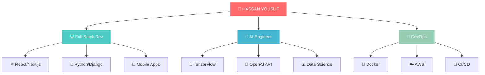

# <div align="center">🚀 **HASSAN MUHAMMAD YOUSUF** 🚀</div>

<div align="center">
  
[](https://git.io/typing-svg)

</div>

---

## <div align="center">⚡ **NEURAL NETWORK ACTIVATED** ⚡</div>

<div align="center">
  
```ascii
    ╭─────────────────────────────────────────────────╮
    │  🧠 AI-POWERED DEVELOPER | 🌍 PAKISTAN → 🇩🇪 GERMANY  │
    │  🎯 CRAFTING TOMORROW'S SOLUTIONS TODAY         │
    ╰─────────────────────────────────────────────────╯
```

</div>


## <div align="center">🛸 **TECH ARSENAL** 🛸</div>

<div align="center">

### 🔥 **CORE SYSTEMS**


### ⚡ **FRONTEND MATRIX**


### 🔧 **BACKEND FORTRESS**


### 🗄️ **DATA VAULTS**


### 🤖 **AI NEURAL CORES**


### 🧪 **TESTING PROTOCOLS**


### 🚀 **DEPLOYMENT SYSTEMS**


</div>

---

## <div align="center">🎯 **DEVELOPER METRICS** 🎯</div>

<div align="center">

```diff
+ 🎓 BEng Software Engineering @ GISMA Business School Berlin
+ 💼 4+ Years IT Support & Development Experience  
+ 🌍 Pakistan → Germany | Bridging Cultures Through Code
+ 🚀 Specializing in Full-Stack Development & AI Integration
```

</div>


---

## <div align="center">📊 **SYSTEM STATISTICS** 📊</div>

<div align="center">


</div>

<div align="center">
  


</div>

<div align="center">

### 🏆 **GITHUB TROPHIES** 🏆


</div>

<div align="center">

### 📈 **CONTRIBUTION GRAPH** 📈


</div>

---

## <div align="center">🌐 **QUANTUM ENTANGLEMENT** 🌐</div>

<div align="center">

[](https://linkedin.com/in/hassan-muhammad-yousuf)
[](https://instagram.com/herr__hassan)
[](mailto:engr.hassanyousuf@gmail.com)
[](https://github.com/Hassan-Muhammad-Yousuf)

</div>

<div align="center">


### 🌟 **SKILL CONSTELLATION** 🌟


```mermaid
graph TD
    A[🧠 HASSAN YOUSUF] --> B[💻 Full Stack Dev]
    A --> C[🤖 AI Engineer]
    A --> D[🔧 DevOps]
    
    B --> E[⚛️ React/Next.js]
    B --> F[🐍 Python/Django]
    B --> G[📱 Mobile Apps]
    
    C --> H[🎯 TensorFlow]
    C --> I[🧪 OpenAI API]
    C --> J[📊 Data Science]
    
    D --> K[🐳 Docker]
    D --> L[☁️ AWS]
    D --> M[🔄 CI/CD]
    
    style A fill:#ff6b6b,stroke:#fff,stroke-width:3px,color:#fff
    style B fill:#4ecdc4,stroke:#fff,stroke-width:2px,color:#fff
    style C fill:#45b7d1,stroke:#fff,stroke-width:2px,color:#fff
    style D fill:#96ceb4,stroke:#fff,stroke-width:2px,color:#fff
```

</div>

---

<div align="center">

### 💫 **"Code is poetry written in logic"** 💫


[](https://visitcount.itsvg.in)

**⭐ Star my repos if you find them interesting! ⭐**


</div>
